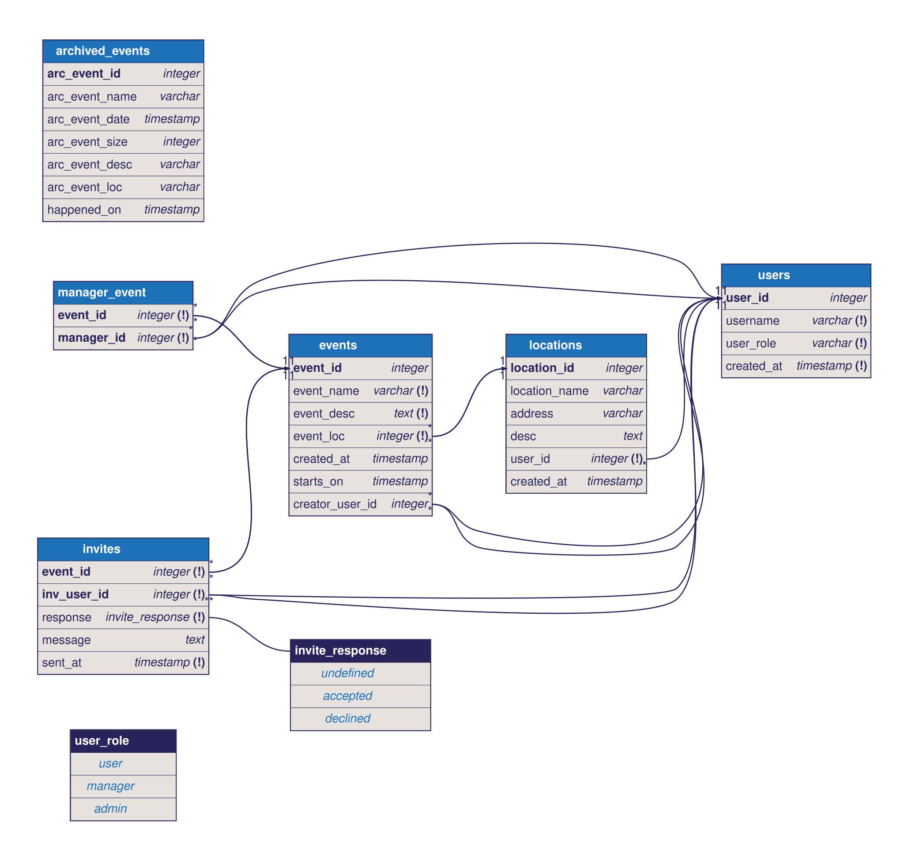

# Event Tracker API Proposal

## 1. The pitch (one paragraph)
Our API tracks event information created by users and can track which guests RSVPd and what their response is. 
A user is anyone who is attending an event or hosting an event and hosts are able to manage the event details 
such as name, description, location, date/time. A client app would need the API because there is information that not all users
need to have access too. A user does not need to access all events, just the events they are going to be attending. It also saves space
because users would only have information stored that they need access to rather than all events ever.

## 2. Resources 

| Resource | Key fields | Relationships |
| -- | -- | --|
| User | userId, username, password, createdAt| a User can create many Events, a User can have many Rsvps, a User has one Role |
| Role | roleId, userId, eventId, role, | a Role has a single User |
| Location | locationId, locationName, address, description, createdAt| a Location has many Event |
| Event | eventId, creatorId, locationId, eventDate, createdAt, description | an Event has one User, an Event has one Location, an Event has many Rsvps |
| Rsvp | eventId, userId, response | a Rsvp has one User, a Rsvp has one Event |

(Role table is for backend confirmation, if someone has permissions to do something based on what role they have)

## 3. ER sketch
Tables, primary and foreign keys, and cardinality. Edits to [schema.dbml](diagrams/schema.dbml) automatically get rendered here through a GitHub workflow.

## 4. Endpoints
| Verb   | Path                   | Auth   | Purpose                                                     |
|--------|------------------------|--------|-------------------------------------------------------------|
| GET    | /api/v1/userRsvps      | user   | list user rsvps (paginate, filters)                         |
| GET    | /api/v1/userInfo       | user   | list user information(filter)                               |
| GET    | /api/v1/eventInfo      | user   | list information about event (filter)                       |
| GET    | /api/v1/eventAttendees | admin  | list of users who are attending an event (filter, paginate) |
| GET    | /api/v1/totalAttendees | user   | see number of attendees for an event (filter)               |
| GET    | /api/v1/getLocations   | admin  | list of locations available to host an event at (paginate)  |
| POST   | /api/v1/createUser     | public | sign up new users                                           |
| POST   | /api/v1/createEvent    | admin  | create a new event                                          |
| POST   | /api/v1/createRsvp     | admin  | send invites to users for an event                          |
| POST   | /api/v1/createLocation | admin  | add a new location to database                              |
| PUT    | /api/v1/updateUser     | user   | edit user info(filter)                                      |
| PUT    | /api/v1/updateEvent    | admin  | update event info(filter)                                   |
| PUT    | /api/v1/updateRsvp     | admin  | update invites sent to users for an event (filter)          |
| PUT    | /api/v1/updateLocation | admin  | update event location information (filter)                  |
| PATCH  | /api/v1/editUserInfo   | user   | change username/password (filter)                           |
| PATCH  | /api/v1/editEventDate  | admin  | change event date (filter)                                  |
| DELETE | /api/v1/deleteUser     | user   | remove user                                                 |
| DELETE | /api/v1/deleteEvent    | admin  | delete an event                                             |

Mark each endpoint `public`, `user`, or `admin`. Mark which collection paginates and which
filters or sorts.

## 5. Technical choices
- **Database host:** We are using Neon because we are all familiar with Postgres SQL and Neon is a good remote host and easy to use. 
- **OAuth2 provider:** Google, it [supports PKC](https://developers.google.com/identity/protocols/oauth2/native-app#step1-code-verifier)
- **Repo layout:** We are doing a split repo layout because realistically they are two different projects with different end goals. 

These become your ADRs later.

## 6. Risks
The two things most likely to go wrong, and what you will do first to find out.
1. Neon might go down. We can check the official Neon website to see if they have information posted about the outage. 
2. Google OAuth might have a problem if the service goes down or the people sessions aren't being saved. We will check Google for a statement since Google Oauth is a largely used service.

## 7. Team and Sprint 1
 - Billy is working on allowing managers to host the event. 
 - Ann is working on allowing users to see how many people are attending an event.
 - Sarah is working on users are able to see what the events they are invited to.
 - Paul is working on managers being able to see who is attending the event.

[Project board](https://github.com/users/paullert/projects/1)

[Sprint 1 milestone](https://github.com/paullert/project2_s1_g2_event_tracker_api/milestone/1)
